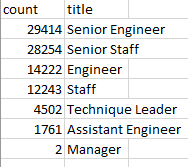

<h1>Pewlett-Hackard-Analysis</h1>
<h2>Overview</h2>
The purpose of this analysis was to utilize SQL to parse through all employee data in order to determine how many employees are retiring from Pewlett Hackard and the number of positions need to be filled in the near future. Additionally, we determined the number of current employees that are eligible to participate in a proposed mentoring program.
<h2>Results</h2>
<ul> 
  <li>90,398 employees will be retiring in the near future.</li>
  <li>Out of the retiring employees, 43,636 are senior staff, and 2 managers.</li>
  <li>7 unique positions will need to be filled (see figure below for titles and counts).</li>
  </img>
  <li>1,550 employees are eligible to participate in the proposed mentorship program.</li>
</ul>
<h2>Summary</h2>
In total, there will be ~90,000 employees retiring in the near future. Thus, there will need to be a similar number of new hires to fill in the vacancies. However, there are only 1,550 employees that are eligible to participate in the proposed mentorship program. Given that all the soon-to-retire employees agree to participate in this said program, each would have to mentor ~60 new hires, which is an unrealistic number. Thus, other current employees must also participate in mentoring the new hires in order to make a smooth transition.
